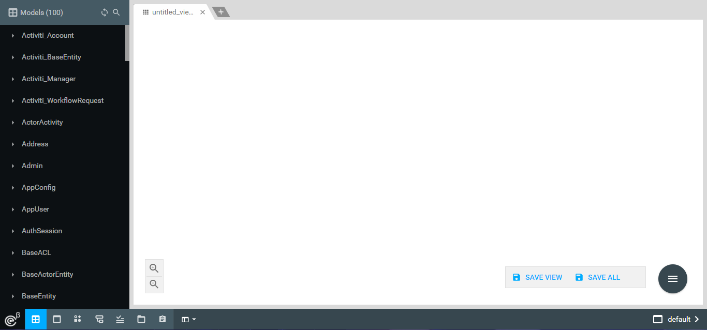
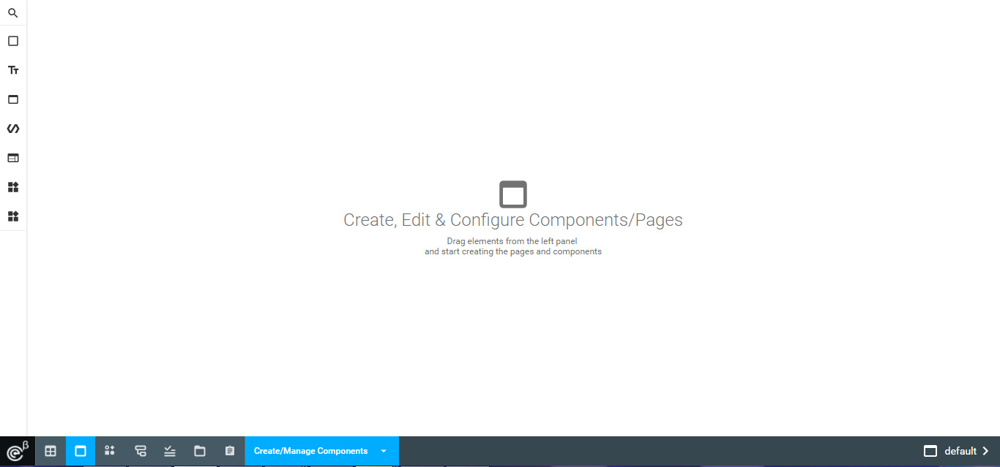
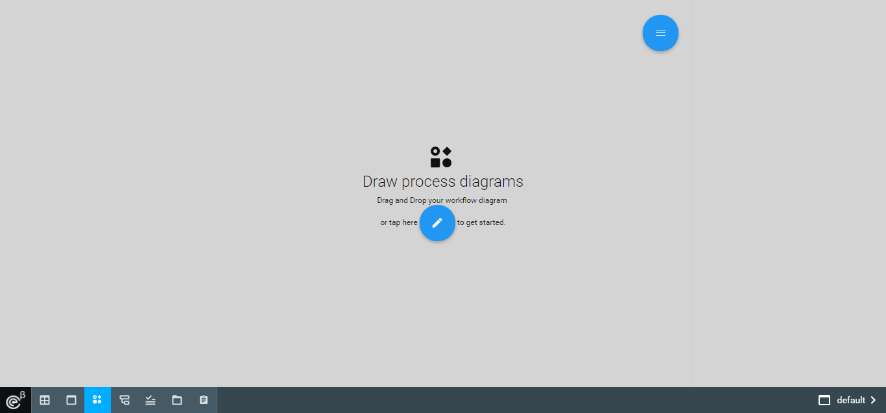
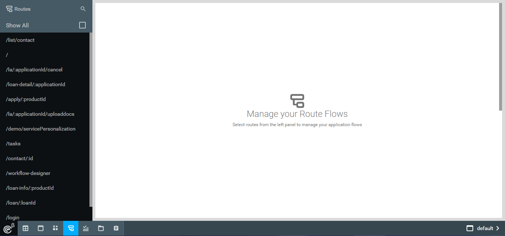
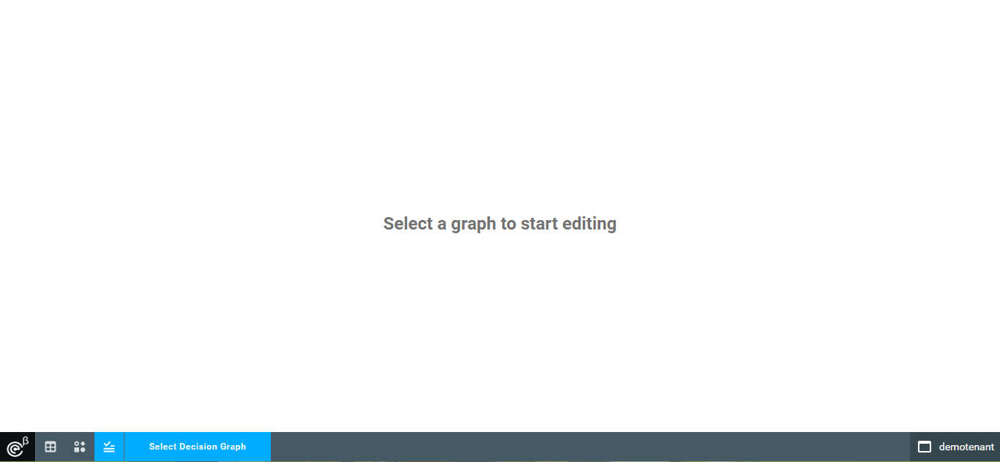
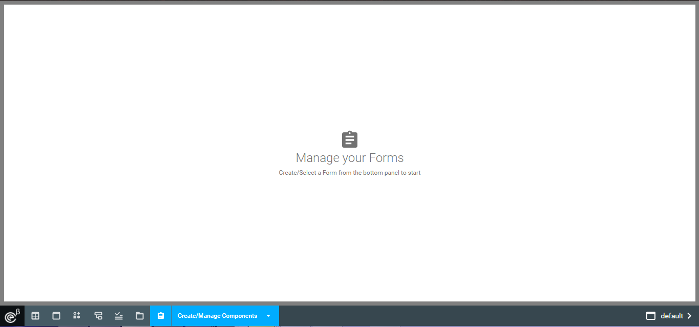

# OE Studio

## Introduction

OE Studio, is a web based tool that is developed to make working with oe-cloud based application easier. 

This tools provides end user a web interface using which he/she (particularly developer) will be able to perform several tasks like creating models, posting and retrieving data from models and other operations with ease.

---
---
__Note : This is an experimental component which may go through major modifications in future releases.__

---
---

## Installing OE Studio

### Prerequisite  : 
oe-cloud based UI app . You can learn about creating a ui-app from https://github.com/EdgeVerve/oe-ui-app .

### Once you have the ui app

* add oe-studio as a bower dependency.
* bower install 
* node .
* Use username and password as "admin" to login.
* Browse oe-studio at localhost:3000/designer

---

# oe-studio modules

* Model Management
  * Manage oe-cloud based models and their data.
  
* UI designer
  * Create simple Polymer based form components and dashboards.
  
* Workflow Modeler
  * Manage workflows related to the running application.
  
* Route Manager
  * Handle event based navigation through ui-routes.
  
* Rule Manager
  * Handle Business rule management and execution.
   
* Resource Manager
  * Handle UI Resources.
   
* Component Manager
  * Manage MetaPolymer based forms. 
   

## More information
Futher detailed documentation on individual modules will be added in future releases.

## License
The project is licensed under MIT License, See [LICENSE](./LICENSE) for more details.

## Contributing
We welcome contributions. Some of the best ways to contribute are to try things out, file bugs, and join in design conversations. 

### [How to contribute](./CONTRIBUTION.md)